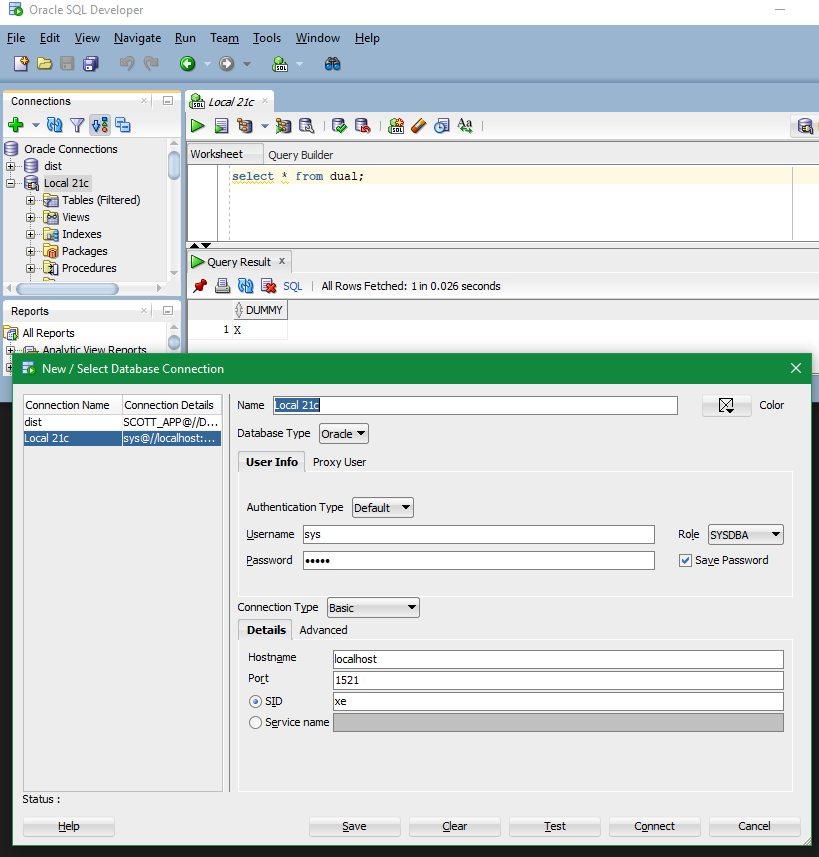
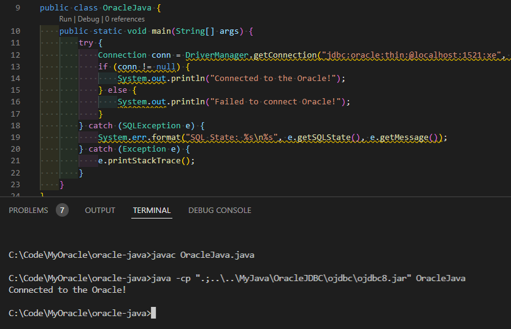
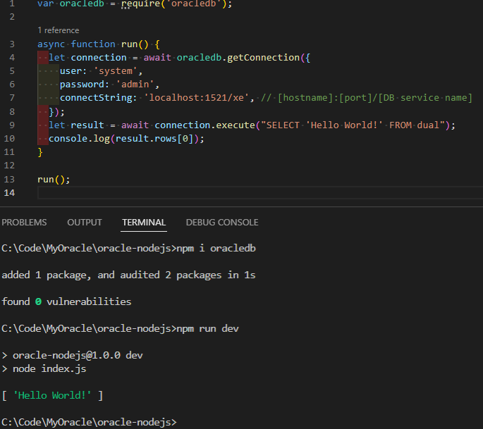
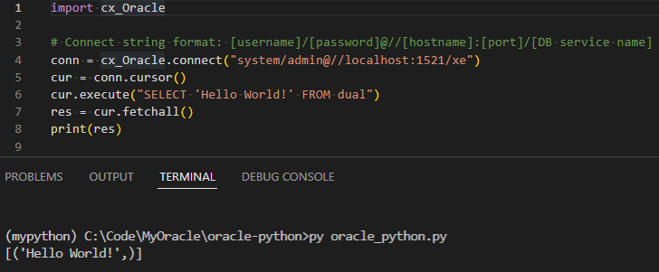
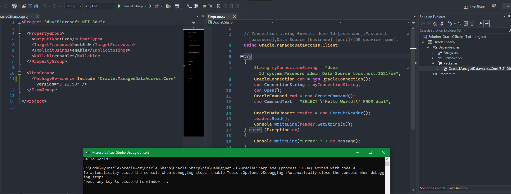
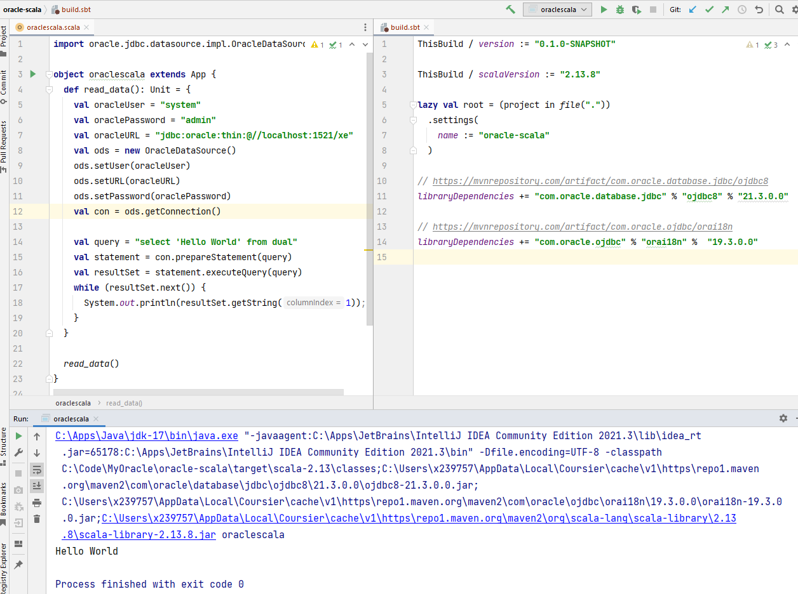

# MyOracle

My Oracle

Oracle is still used in lots of places.

How to make it work well with Cloud is a common question.

## Oracle XE 21c

https://www.oracle.com/il-en/database/technologies/appdev/xe/quickstart.html

### Install Oracle XE 21c at local

### Connect Oracle XE 21c with SQL Developer



### Connect Oracle XE 21c with Java and ojdbc8.jar

download ojdbc8.jar

manually add to maven



### Connect Oracle XE 21c with NodeJS

npm i oracledb



### Connect Oracle XE 21c with Python

pip install cx-Oracle



### Connect Oracle XE 21c with C#

nuget OracleAccess



### Connect Oracle XE 21c with Scala

sbt

```
// https://mvnrepository.com/artifact/com.oracle.database.jdbc/ojdbc8
libraryDependencies += "com.oracle.database.jdbc" % "ojdbc8" % "21.3.0.0"

// https://mvnrepository.com/artifact/com.oracle.ojdbc/orai18n
libraryDependencies += "com.oracle.ojdbc" % "orai18n" %  "19.3.0.0"
```


