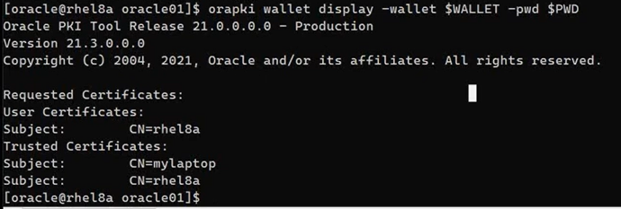
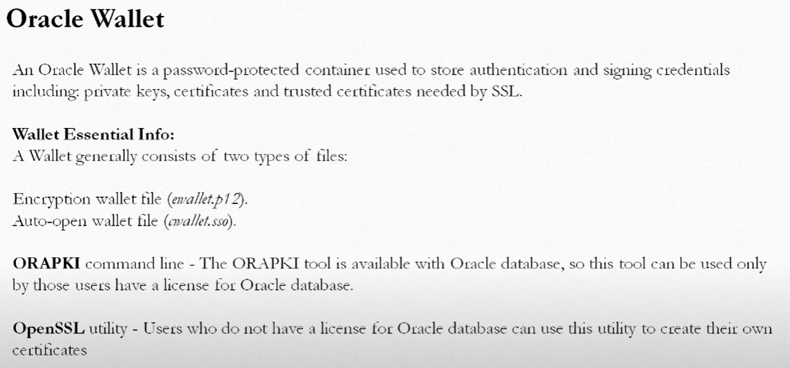
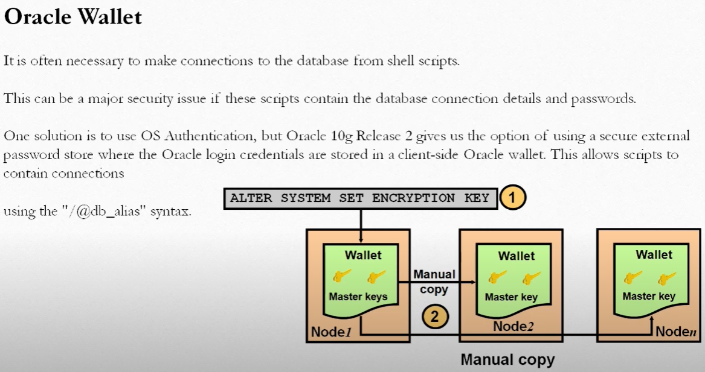
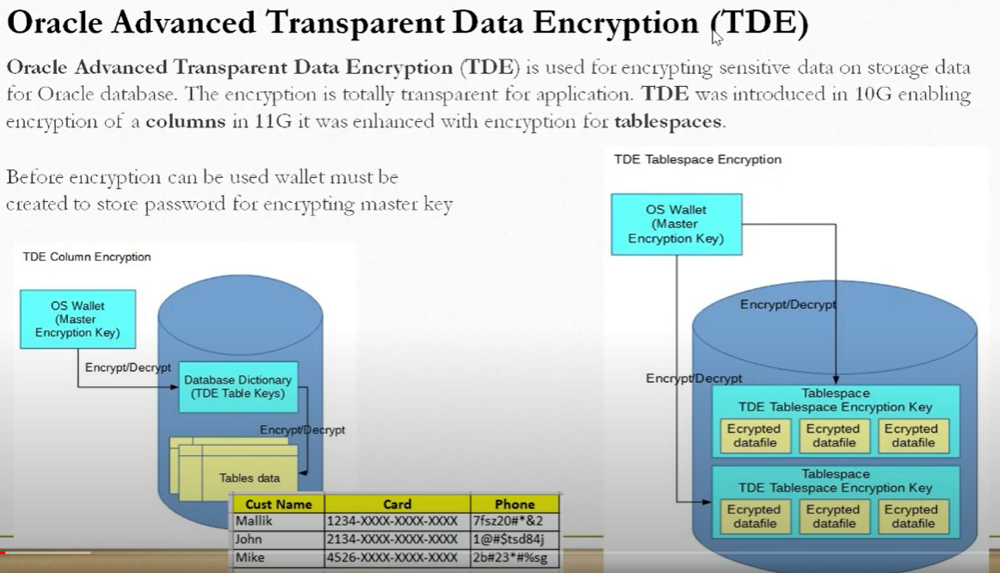

# MyOracle

My Oracle

Oracle is still used in lots of places.

How to make it work well with Cloud is a common question.

## Oracle TLS

Adding SSL/TLS to Oracle 21c

Before:

default TCP port 1521

After:

default TLS port 2484

Steps:

1. Test connection

```
sqlplus system/oracle@cdb
sqlplus sys/oracle@cdb as sysdba
```

2. Create server wallet and certificate with `orapki`

```
orapki help
orapki wallet help
```

logon as oracle user

```
WALLET=$ORACLE_BASE/wallet
PWD=oracle01
mkdir -p $WALLET
ls -lrt $WALLET
```

create a self-signed certficate in the wallet

```
orapki wallet add -wallet $WALLET -pwd $PWD -dn "CN=`hostname =s`" -keysize 2048 -self_signed -validity 7300
```

display the content of the wallet

```
orapki wallet display -wallet $WALLET -pwd $PWD
```

extract the certificate to a file

```
orapki wallet export -wallet $WALLET -pwd $PWD -dn "CN=`hostname =s`" -cert $WALLET/`hostname -s`.cert
cat $WALLET/`hostname -s`.cert
```

3. Create client wallet and certificate with `orapki`

create wallet with `orapki`

```
set WALLET=c:\app\client\wallet
set PWD=oracle01
md %WALLET%
```

create a self-signed certificate in the wallet

```
orapki wallet create -wallet %WALLET% -pwd %PWD% -dn "CN=mylaptop" -keysize 2048 -self_signed -validity 7300
```

check the contents of the wallet

```
orapki wallet display -wallet $WALLET -pwd $PWD
```

extract the certificate to a file

```
orapki wallet export -wallet %WALLET% -pwd %PWD% -dn "CN=mylaptop" -cert %WALLET%\mylaptop.cert
more %WALLET%\mylaptop.cert
```

4. Import server certificate into client wallet

get the server certificate with scp/sftp/winscp/filezilla

```
dir %WALLET%
scp oracle@rhel8a:/u01/app/oracle/wallet/rhel8a.cert %WALLET%/.
dir %WALLET%
```

import server certificate into client wallet with `orapki`

```
orapki wallet add -wallet %WALLET% -pwd %PWD% -trusted_cert -cert %WALLET%\rhel8a.cert
```

check the contents of the wallet

```
orapki wallet display -wallet %WALLET% -pwd %PWD%
```

5. Import client certificate into server wallet

get the client certificate with scp/sftp/winscp/filezilla

```
dir %WALLET%
scp %WALLET%/mylaptop.cert oracle@rhel8a:/u01/app/oracle/wallet/.
```

import client certificate into server wallet with `orapki`

```
orapki wallet add -wallet $WALLET -pwd $PWD -trusted_cert -cert $WALLET/mylaptop.cert
```

check the contents of the wallet

```
orapki wallet display -wallet $WALLET -pwd $PWD
```



6. x

7. x

8. x

9. x

10. x

## Oracle Wallet







## Oracle XE 21c

https://www.oracle.com/il-en/database/technologies/appdev/xe/quickstart.html

### Install Oracle XE 21c at local

### Connect Oracle XE 21c with SQL Developer


### Connect Oracle XE 21c with Java and ojdbc8.jar

download ojdbc8.jar

manually add to maven


### Connect Oracle XE 21c with NodeJS

npm i oracledb


### Connect Oracle XE 21c with Python

pip install cx-Oracle


### Connect Oracle XE 21c with C#

nuget OracleAccess


### Connect Oracle XE 21c with Scala

sbt

```
// https://mvnrepository.com/artifact/com.oracle.database.jdbc/ojdbc8
libraryDependencies += "com.oracle.database.jdbc" % "ojdbc8" % "21.3.0.0"

// https://mvnrepository.com/artifact/com.oracle.ojdbc/orai18n
libraryDependencies += "com.oracle.ojdbc" % "orai18n" %  "19.3.0.0"
```


